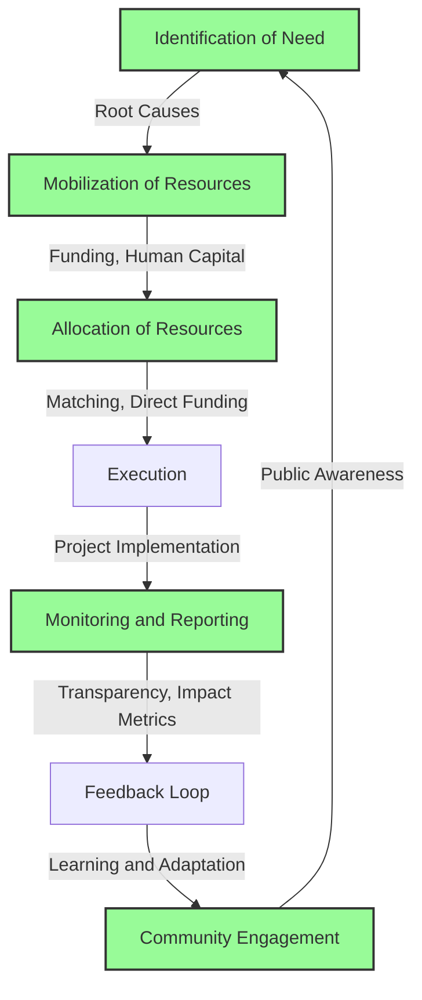

```mermaid
graph TD
    A[Identification of Need] -->|Root Causes| B[Mobilization of Resources]
    B -->|Funding, Human Capital| C[Allocation of Resources]
    C -->|Matching, Direct Funding| D[Execution]
    D -->|Project Implementation| E[Monitoring and Reporting]
    E -->|Transparency, Impact Metrics| F[Feedback Loop]
    F -->|Learning and Adaptation| G[Community Engagement]
    G -->|Public Awareness| A
    style A fill:#98FB98,stroke:#333,stroke-width:2px;
    style B fill:#98FB98,stroke:#333,stroke-width:2px;
    style C fill:#98FB98,stroke:#333,stroke-width:2px;
    style E fill:#98FB98,stroke:#333,stroke-width:2px;
    style G fill:#98FB98,stroke:#333,stroke-width:2px;
```
